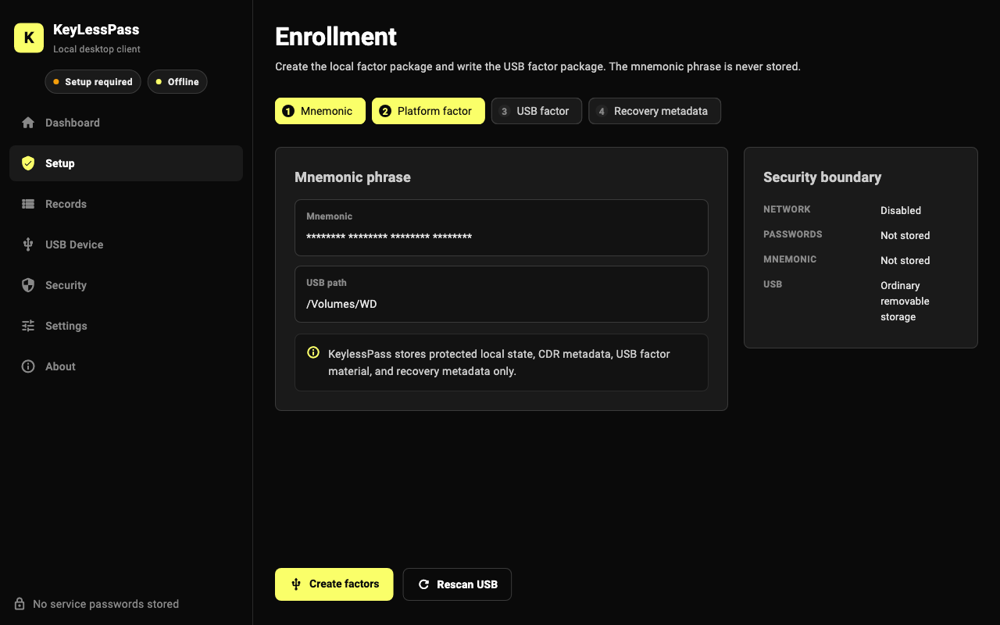
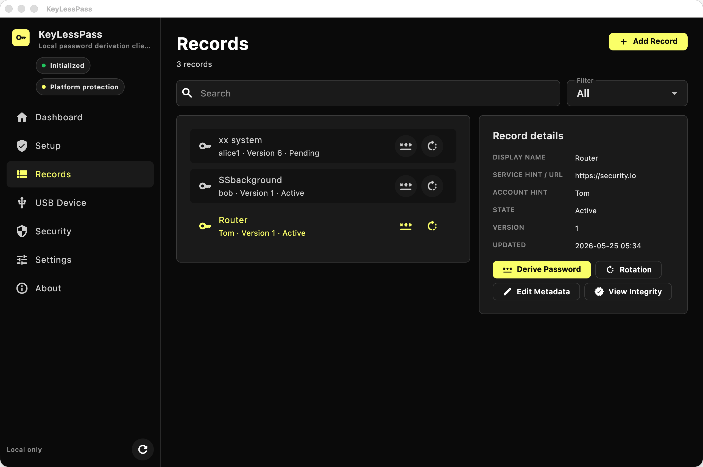
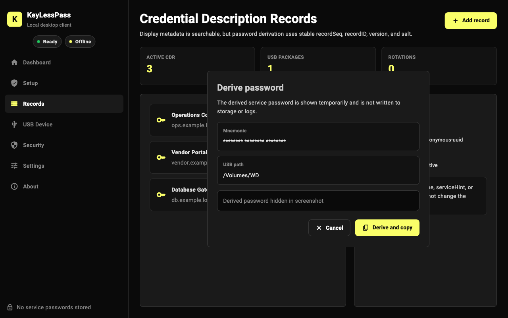
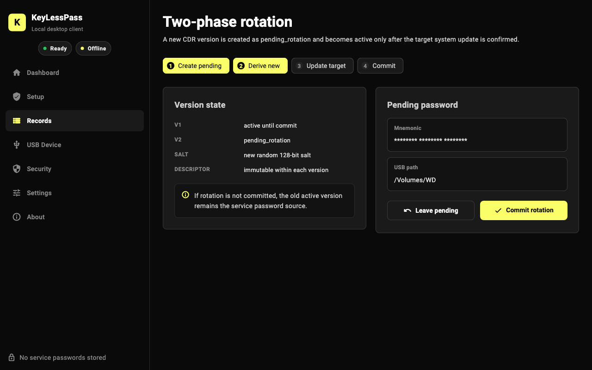
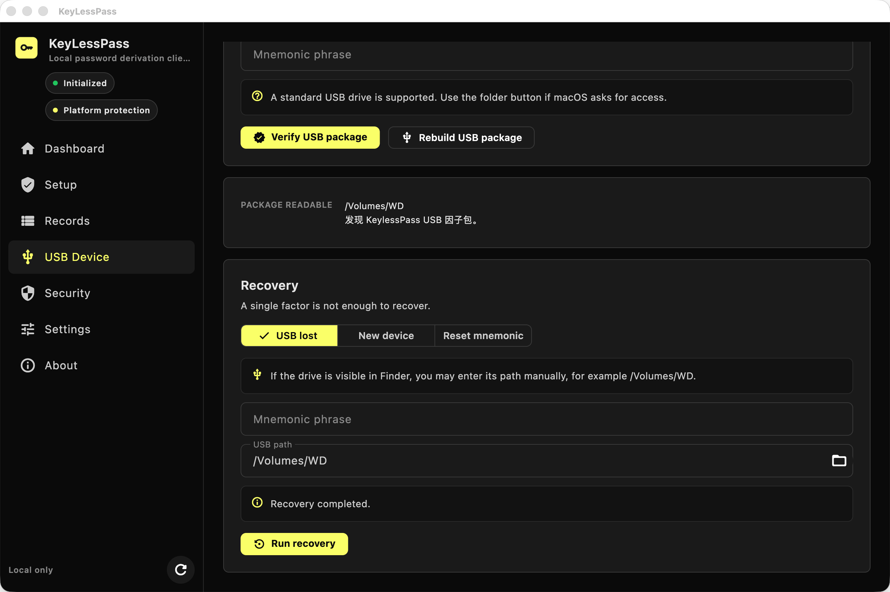
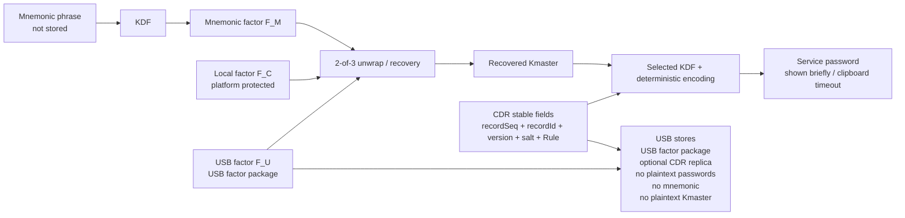

# KeyLessPass

> Keypassless is source-available, not open-source.
> The code is provided for evaluation, security review, learning, and non-commercial testing only.
> Commercial use, enterprise deployment, redistribution, OEM integration, white-label use, managed service use, or channel resale requires a separate written commercial license.

> Keypassless 采用“源码可见但非开源”的授权模式。
> 本仓库代码仅供评估、安全审查、学习和非商业测试使用。
> 企业部署、商业使用、二次分发、OEM 集成、白标使用、托管服务或渠道销售，均需另行取得书面商业授权。

<p align="center">
  
</p>

<p align="center">
  <strong>Storage-free local password derivation for desktop enterprise workflows.</strong>
</p>

<p align="center">
  <a href="README.zh-CN.md">简体中文</a>
  ·
  <a href="SECURITY.md">Security</a>
  ·
  <a href="COMMERCIAL.md">Commercial</a>
  ·
  <a href="PRIVACY.md">Privacy</a>
  ·
  <a href="RELEASE.md">Release</a>
</p>

<p align="center">
  
  
  
  
  
</p>

KeyLessPass is a native desktop client for deriving text passwords on demand for internal systems that still depend on legacy password login. It is intended for operations consoles, vendor portals, database gateways, network appliances, and small enterprise environments where a local-only security posture is required.

It is not a web app, not a browser extension, not a cloud password manager, and not a password vault. KeyLessPass does not store target-system plaintext passwords, does not maintain an encrypted service-password database, and does not store the mnemonic phrase.

## Product Screenshots

| Setup | Records |
| --- | --- |
|  |  |

| Derive Password | Rotation |
| --- | --- |
|  |  |

| USB Device and Recovery |
| --- |
|  |

## Why KeyLessPass

Traditional password managers protect a vault of stored secrets. KeyLessPass takes a different path: it stores only protected local state, USB factor material, Credential Description Records, and recovery metadata. The service password is derived only when the user provides the required local factors.

This makes it useful when an organization must keep using legacy password-based systems but wants to avoid accumulating a recoverable password vault on endpoints.

## Core Features

- Native Flutter Desktop UI with a Rust security core.
- Local SQLite storage for non-secret CDR metadata and integrity tags.
- Ordinary removable USB drive support for USB factor packages.
- CDR metadata backup on the USB drive, with local/USB consistency checks and explicit sync/restore choices.
- Random per-user master key generated during enrollment.
- English and Simplified Chinese mnemonic generation on the local device.
- Mnemonic reset using this device plus the paired USB package, without changing existing derived passwords.
- Service derivation based on stable `recordSeq`, `recordId`, `version`, `salt`, and `encodingDescriptor`.
- Selectable service derivation algorithm for new profiles: HKDF-SHA256, Argon2id, scrypt, or PBKDF2-HMAC-SHA256.
- Editable display metadata that does not change derived passwords.
- Two-phase password rotation with pending, commit, and cancel states.
- Local recovery workflows for rebuilding missing USB or local factor packages.
- USB management for path selection, package verification, and package rebuild.
- Redacted diagnostics export.
- Cross-platform provider abstraction for macOS, Windows, Linux, and fallback secure storage.
- English and Simplified Chinese UI resources.

## What Is Stored

| Stored locally | Not stored |
| --- | --- |
| Protected local factor package | Target-system plaintext passwords |
| USB factor package on a user-selected USB drive | Encrypted service-password vault |
| CDR metadata, salts, versions, MAC tags, and optional USB CDR backup | Mnemonic phrase |
| Recovery metadata for local two-factor recovery operations | Cloud account, sync state, analytics |

## How It Works

During enrollment, KeyLessPass generates a random 256-bit per-user master key. The mnemonic phrase is not the root seed for service passwords and is not stored. It is transformed into an independent mnemonic factor `F_M`, which participates with the local factor `F_C` and USB factor `F_U` in the local 2-of-3 unwrap/recovery model for `Kmaster`. Service password derivation then uses the recovered `Kmaster` plus stable CDR path fields.

For compatibility, existing profiles without an algorithm field are treated as legacy HKDF-SHA256. New profiles can choose HKDF-SHA256, Argon2id, scrypt, or PBKDF2-HMAC-SHA256 before enrollment; the choice is locked for that local profile and can be changed only after resetting local application data and initializing again.

For each credential record, KeyLessPass stores only non-secret CDR metadata. Display fields such as name, service hint, account hint, and notes are searchable and editable, but they are not part of the derivation path. Password rule changes create a new CDR version and are treated as rotation.

When a paired USB drive is present, KeyLessPass can write a signed CDR metadata backup to the USB drive. On refresh or insertion detection, the app compares local CDR metadata with the USB backup and prompts the user to either sync local records to USB or restore local records from the USB backup.



## Security Model

- No target-system plaintext password is written to disk.
- No encrypted service-password vault is maintained.
- No mnemonic phrase is stored.
- No cloud sync, remote backend, browser autofill, or account login is included.
- All random values come from the operating system CSPRNG.
- CDR and factor packages are integrity checked before use.
- USB CDR backups are MAC-protected and contain metadata only, never service passwords.
- Derived passwords are masked by default and cleared from the clipboard after a configurable timeout.
- Sensitive values such as mnemonic text, master key, factor secrets, raw HKDF output, AEAD keys, HMAC keys, and derived passwords must not be logged.

Client-only rollback detection is limited to local and USB metadata checks. Stronger rollback protection can be added through an external version digest, append-only audit log, or trusted monotonic state integration.

## Desktop Navigation

The product UI is organized around stable desktop modules:

- Dashboard
- Setup
- Records
- USB Device
- Security
- Settings
- About

Record-centric actions such as add, derive, and rotation are launched from Records. Recovery tools, USB factor verification, CDR backup sync, and local restore from USB are grouped under USB Device.

## Architecture

```text
KeyLessPass
├── flutter_app/          # Flutter Desktop UI
├── rust_core/            # Rust cryptography, storage, recovery, and FFI core
├── packaging/            # macOS, Windows, and Linux packaging scripts
├── docs/                 # Product, security, readiness, and design documentation
└── releases/             # Local release artifacts, ignored by git
```

The Rust core is intentionally independent from platform-specific secure storage details. Platform factor providers implement a common interface, with macOS Keychain, Windows DPAPI, Linux local/fallback storage, and future TPM/Secure Enclave hooks isolated behind the provider layer.

## Quick Start

### Prerequisites

- Flutter Desktop SDK
- Rust toolchain
- macOS: Xcode for desktop builds
- Windows: Visual Studio Build Tools for desktop builds
- Linux: Flutter Linux desktop dependencies

### Build and Test the Core

```bash
cd rust_core
cargo test
```

### Run the Desktop App

```bash
cd flutter_app
flutter pub get
flutter analyze
flutter test
flutter run -d macos
```

### macOS Release Build

```bash
DEVELOPER_DIR=/Applications/Xcode.app/Contents/Developer \
FLUTTER_BIN=/path/to/flutter \
CODESIGN_IDENTITY='-' \
packaging/macos/build_dmg.sh
```

The local unsigned app bundle is produced under:

```text
flutter_app/build/macos/Build/Products/Release/KeyLessPass.app
```

For distribution, sign with a Developer ID Application certificate and notarize the DMG. See [RELEASE.md](RELEASE.md).

## Internationalization

UI strings are sourced from Flutter ARB resources:

- `flutter_app/lib/l10n/app_en.arb`
- `flutter_app/lib/l10n/app_zh.arb`

The app follows the system language by default and supports manual English / Simplified Chinese selection in Settings.

## Current Status

macOS is the primary tested desktop target. The architecture and packaging scripts reserve Windows and Linux support, including platform factor provider separation for future hardening.

The Rust test suite covers derivation stability, metadata immutability boundaries, path-field sensitivity, tamper failures, missing factors, rotation behavior, recovery behavior, USB CDR backup sync/restore, mnemonic reset, and platform provider trait tests. Flutter tests cover UI construction, navigation, language switching, and i18n resource completeness.

## Roadmap

- Developer ID signing and notarized macOS DMG.
- Windows DPAPI hardening and MSI packaging validation.
- Linux Secret Service/libsecret option and deb/rpm/AppImage packaging validation.
- Optional external version digest or append-only audit integration.
- Enterprise diagnostics export with stricter redaction review.

## Documentation

- [SECURITY.md](SECURITY.md)
- [PRIVACY.md](PRIVACY.md)
- [RELEASE.md](RELEASE.md)
- [CONTRIBUTING.md](CONTRIBUTING.md)
- [DEVELOPMENT.md](DEVELOPMENT.md)
- [docs/PRODUCTIZATION_REPORT.md](docs/PRODUCTIZATION_REPORT.md)
- [docs/STORE_READINESS_CHECKLIST.md](docs/STORE_READINESS_CHECKLIST.md)

## License

Keypassless is source-available, not open-source. See [LICENSE](LICENSE), [NOTICE](NOTICE), and [COMMERCIAL.md](COMMERCIAL.md).

Personal learning, evaluation, security review, and non-commercial testing are permitted under the license terms. Commercial use, enterprise production deployment, redistribution, OEM or white-label integration, managed service use, security service bundling, channel resale, and processing real production credentials require a separate written commercial license.
