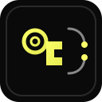
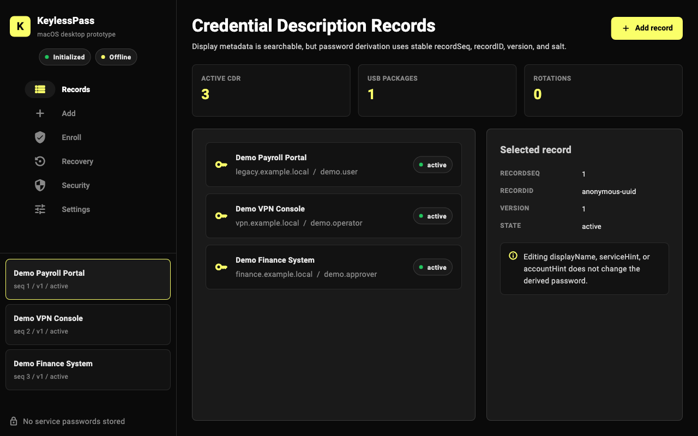
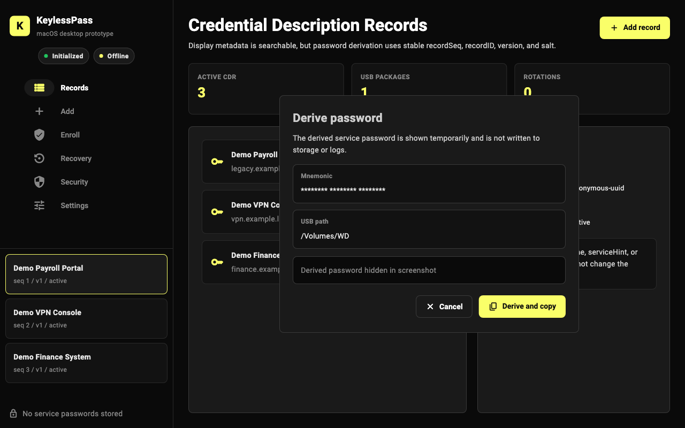
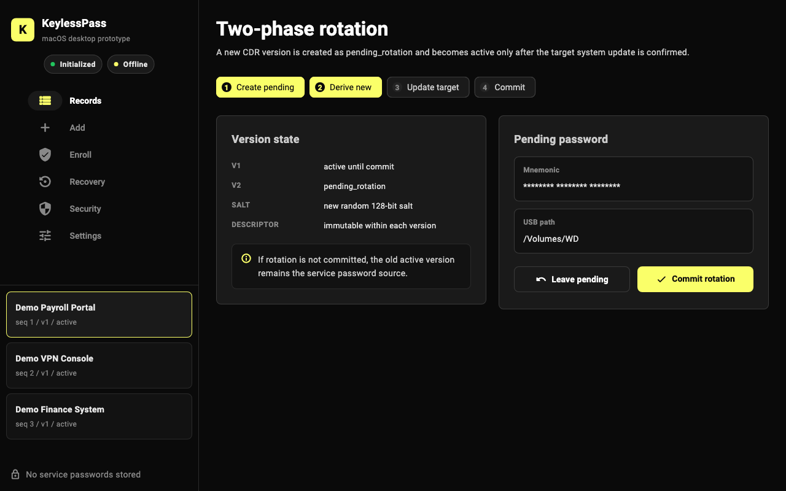

<p align="center">
  
</p>

<h1 align="center">KeyLessPass</h1>

<p align="center">
  <strong>Local-only desktop password manager prototype — derive passwords on demand, store no password vault.</strong>
</p>

<p align="center">
  <a href="https://github.com/ferrarif1/KeyLessPass">GitHub</a>
  ·
  <a href="README.zh-CN.md">简体中文</a>
  ·
  <a href="docs/DESIGN.md">Design</a>
  ·
  <a href="docs/SECURITY.md">Security</a>
</p>

---

KeyLessPass is a **local-only** desktop prototype for managing service credentials without a traditional encrypted password database. It does **not** persist plaintext target-system passwords on disk. When you need a password, the app **deterministically derives** it from a master key, device-bound factors, and a USB factor package. Local SQLite stores only **CDR (Credential Derivation Record)** metadata and integrity tags — never the derived password.

This repository is a standalone Git project ([`ferrarif1/KeyLessPass`](https://github.com/ferrarif1/KeyLessPass)). If you obtained it via the parent `PwdDriver` workspace, KeyLessPass usually lives at `PwdDriver/KeyLessPass/` alongside other materials; builds are independent.

## Features

- **No password vault** — Target-system plaintext passwords are not stored; the mnemonic phrase is never persisted locally ([`docs/SECURITY.md`](docs/SECURITY.md)).
- **Multi-factor derivation** — Enrollment combines a mnemonic, a platform factor, and a USB factor package; derivation verifies factor integrity (HMAC and related checks).
- **CDR management** — SQLite holds stable derivation fields (`recordSeq`, `recordId`, `version`, `salt`, `encodingDescriptor`). Display fields (`displayName`, `serviceHint`, `accountHint`) do not affect derivation ([`docs/DESIGN.md`](docs/DESIGN.md)).
- **Flutter desktop UI** — Credential list, add record, enrollment, recovery, security status, and settings; keyboard shortcuts for derive and rotation.
- **Password rotation** — Changing `encodingDescriptor` creates a new version; a two-phase flow requires explicit confirmation before the new version becomes active.
- **Recovery** — Rebuild missing material via USB factor package or local recovery paths.
- **Cross-platform desktop** — Targets **macOS, Windows, and Linux** with platform-specific factor protection (macOS Keychain, Windows DPAPI extension point, Linux local AEAD + file permissions; fallback mode is surfaced when protection is unavailable).
- **JSON FFI** — Flutter calls Rust through a small C ABI (`keylesspass_ffi_json` / `keylesspass_ffi_free`).

**Explicitly out of scope:** web services, cloud sync, browser extensions, browser autofill, and a WebView-based main UI.

## Screenshots

UI captures are generated from the Flutter evidence golden tests (demo data; derived passwords are masked in images).

| Enrollment | Credential records |
|:---:|:---:|
|  |  |

| Derive password | Rotation workflow |
|:---:|:---:|
|  |  |

To refresh screenshots after UI changes:

```bash
cd flutter_app
flutter test test/evidence_screenshots_test.dart --update-goldens
cp test/goldens/*.png ../docs/assets/screenshots/
```

## Tech stack

| Component | Technology |
|-----------|------------|
| UI | Flutter Desktop (`keylesspass_desktop`) |
| Core & cryptography | Rust `keylesspass_core` (`rlib` / `cdylib` / `staticlib`) |
| Local metadata | SQLite (`rusqlite`, bundled) |
| Crypto primitives | HKDF-SHA256, HMAC-SHA256, AES-GCM, and related building blocks |

## Prerequisites

- **Rust** — stable toolchain ([`rust-toolchain.toml`](rust-toolchain.toml)); crate requires **Rust ≥ 1.77**
- **Flutter** — SDK **≥ 3.3.0** ([`flutter_app/pubspec.yaml`](flutter_app/pubspec.yaml))
- **Desktop platform SDKs**
  - macOS: Xcode / macOS desktop support
  - Windows: Visual Studio build tools + Windows desktop support
  - Linux: GTK and other Flutter Linux desktop dependencies
- **Optional** — Writable USB volume path for enrollment/recovery factor packages

If platform folders (`macos/`, `windows/`, `linux/`) are missing after clone, run [`tools/init_flutter_desktop.sh`](tools/init_flutter_desktop.sh) to scaffold Flutter multi-desktop project files.

## Install and build

### 1. Build Rust core

```bash
./tools/build_rust_core.sh
```

Or from `rust_core/`:

```bash
cargo build           # debug library for flutter run
cargo build --release # release builds / packaging
```

### 2. Flutter dependencies

```bash
cd flutter_app
flutter pub get
```

### 3. Run in development

Build the **debug** `libkeylesspass_core` (or `keylesspass_core.dll` on Windows) first. Flutter resolves the dynamic library next to the executable and under `../rust_core/target/debug/` (see [`flutter_app/lib/ffi/rust_core.dart`](flutter_app/lib/ffi/rust_core.dart)).

```bash
cd flutter_app
flutter run -d macos    # or windows / linux
```

### 4. Release packaging

| Platform | Script |
|----------|--------|
| macOS | [`packaging/macos/build_dmg.sh`](packaging/macos/build_dmg.sh) |
| Linux | [`packaging/linux/build_packages.sh`](packaging/linux/build_packages.sh) |
| Windows | [`packaging/windows/build_installer.ps1`](packaging/windows/build_installer.ps1) |

Each script runs `cargo build --release` and `flutter build <platform> --release`, then copies `libkeylesspass_core` into the app bundle or output directory. DMG, DEB/RPM/AppImage, and MSI/EXE installers require additional signing and installer tooling on your machine (scripts print reminders).

## Usage

1. **Enroll (first run)** — Enter a mnemonic and choose a writable USB path to create local and USB factor packages. The mnemonic is **not** written to disk.
2. **Add a credential** — Configure `encodingDescriptor` and stable derivation fields; persist a new CDR row.
3. **Derive a password** — Select a record and derive; the password is shown briefly and can be copied. The clipboard is **cleared after about 30 seconds**; nothing is logged or stored locally.
4. **Rotate** — Update encoding or version, follow the pending → confirm workflow.
5. **Recover** — Use USB or local recovery when a factor package is missing (see the in-app Recovery view).
6. **Security status** — Inspect platform factor protection (Keychain, DPAPI, fallback, etc.).

If the device is already enrolled, ordinary re-enrollment is blocked to avoid overwriting master-key-dependent recovery material. Use recovery to rebuild a missing package, or an explicit factory reset (prototype capability; production deployments need a dedicated design).

### Keyboard shortcuts

| Shortcut | Action |
|----------|--------|
| <kbd>Ctrl</kbd>/<kbd>⌘</kbd> + <kbd>N</kbd> | Open add-credential view |
| <kbd>Ctrl</kbd>/<kbd>⌘</kbd> + <kbd>D</kbd> | Derive password for selected record |
| <kbd>Ctrl</kbd>/<kbd>⌘</kbd> + <kbd>R</kbd> | Start rotation for selected record |

## Configuration

### Data directory

Default application data locations (overridable via environment variable):

| Platform | Default path |
|----------|----------------|
| macOS | `~/Library/Application Support/KeylessPass/` |
| Windows | `%APPDATA%\KeylessPass\` |
| Linux | `$XDG_DATA_HOME/keylesspass` or `~/.local/share/keylesspass` |

Typical files inside:

| File | Purpose |
|------|---------|
| `keylesspass-config.json` | Application configuration |
| `cdr.sqlite3` | CDR database |
| `local-factor-package.json` | Protected local factor package |
| `recovery-metadata.json` | Recovery metadata |

### Environment variables

| Variable | Description |
|----------|-------------|
| `KEYLESSPASS_HOME` | When set, used as the application data root (overrides platform defaults) |

## Testing

**Rust:**

```bash
cd rust_core
cargo test
```

**Flutter:**

```bash
cd flutter_app
flutter test
```

**Evidence / demo harnesses** (temporary directories, simulated USB, JSON output):

```bash
cd rust_core
cargo run --example evidence_harness
cargo run --example seed_ui_state
```

## Project structure

```
KeyLessPass/
├── rust_core/              # keylesspass_core: crypto, CDR, factors, FFI, platforms
│   ├── src/
│   │   ├── crypto/         # KDF, AEAD, MAC, encoding, recovery algorithms
│   │   ├── domain/         # CDR, factors, configuration models
│   │   ├── service/        # enroll, derive, rotate, recover
│   │   ├── storage/        # SQLite, factor packages, USB storage
│   │   ├── platform/       # macOS / Windows / Linux factor providers
│   │   └── ffi.rs          # JSON FFI entry points
│   └── examples/           # evidence_harness, seed_ui_state
├── flutter_app/            # keylesspass_desktop: UI + FFI bindings
├── docs/
│   ├── DESIGN.md           # architecture & derivation boundaries
│   ├── SECURITY.md         # security notes
│   └── assets/             # logo, UI screenshots
├── tools/                  # build_rust_core.sh, init_flutter_desktop.sh
├── packaging/              # per-platform release scripts
└── rust-toolchain.toml
```

## FFI operations

Request shape:

```json
{"op":"<operation>","payload":{...}}
```

Response shape:

```json
{"ok":true,"data":{...}}
```

or

```json
{"ok":false,"error":"..."}
```

| `op` | Description |
|------|-------------|
| `getAppStatus` | Enrollment state, config, security summary |
| `getSecurityStatus` | Platform protection status |
| `listCredentials` | List CDR rows |
| `listUsbCandidates` | Enumerate candidate USB paths |
| `enroll` | First-time enrollment |
| `addCredential` | Add a credential record |
| `updateCredentialDisplay` | Update non-derivation display fields |
| `derivePassword` | Derive service password |
| `rotateCredential` / `confirmRotation` | Rotation workflow |
| `recoverUsb` / `recoverLocal` | USB or local recovery |

Sensitive derivation and recovery failures return generalized errors at the FFI boundary ([`docs/DESIGN.md`](docs/DESIGN.md)).

## Documentation

- [**DESIGN.md**](docs/DESIGN.md) — Architecture, derivation field boundaries, `PlatformFactorProvider`, FFI contract
- [**SECURITY.md**](docs/SECURITY.md) — Randomness, persistence boundaries, logging, MVP rollback detection scope
- [**README.zh-CN.md**](README.zh-CN.md) — Chinese documentation

## License

There is **no** `LICENSE` file at the repository root. Confirm licensing with the upstream maintainer before redistribution; consider adding an explicit license if you plan to open-source the project.

## Links

- Public repository: <https://github.com/ferrarif1/KeyLessPass>
