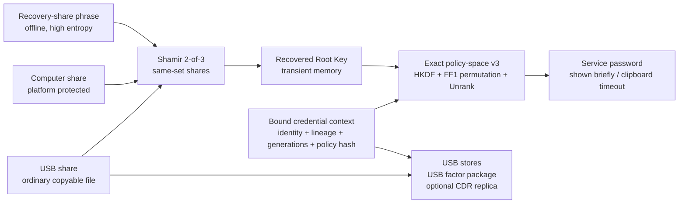

# KeyLessPass

<p align="center">
  
</p>

<p align="center">
  <strong>Service-password derivation and lifecycle management for legacy enterprise systems.</strong>
</p>

<p align="center">
  <a href="README.zh-CN.md">简体中文</a>
  ·
  <a href="SECURITY.md">Security</a>
  ·
  <a href="PRIVACY.md">Privacy</a>
  ·
  <a href="RELEASE.md">Release</a>
  ·
  <a href="DOCS.md">Docs</a>
</p>

<p align="center">
  
  
  
  
</p>

<p align="center">
  <a href="https://github.com/ferrarif1/KeyLessPass/releases/tag/v1.0-jisa-2026">
    
  </a>
  <a href="https://github.com/ferrarif1/KeyLessPass/releases/tag/v1.0-jisa-2026">
    
  </a>
</p>

<p align="center">
  <sub>Open the release page and choose the macOS or Windows client asset for your device.</sub>
</p>

KeyLessPass is a native desktop client for deriving text passwords on demand for internal systems that still depend on legacy password login. It is intended for operations consoles, vendor portals, database gateways, network appliances, and small enterprise environments where a local-only security posture is required.

It is not a web app, browser extension, cloud password manager, or password vault. KeyLessPass does not store target-system plaintext passwords or maintain an encrypted service-password database. Its v3 paper recovery share is an offline encoding of a random high-entropy Shamir share; it is not a phrase users are expected to memorize and is not persisted by the application.

## Product Screenshots

| Setup | Records |
| --- | --- |
|  |  |

| Derive Password | Rotation |
| --- | --- |
|  |  |

| USB Device and Recovery |
| --- |
|  |

## Why KeyLessPass

Traditional password managers protect a vault of stored secrets. KeyLessPass takes a different path: it stores only protected local state, USB factor material, Credential Description Records, and recovery metadata. The service password is derived only when the user provides the required local factors.

This makes it useful when an organization must keep using legacy password-based systems but wants to avoid accumulating a recoverable password vault on endpoints.

## Core Features

- Native Flutter Desktop UI with a Rust security core.
- Local SQLite storage for non-secret CDR metadata and integrity tags.
- Ordinary removable USB drive support for USB factor packages.
- CDR metadata backup on the USB drive, with local/USB consistency checks and explicit sync/restore choices.
- Random per-user master key generated during enrollment.
- Mature Shamir 2-of-3 Root-Key sharing through `vsss-rs`, with authenticated, vault/version-bound share envelopes.
- A checksum-protected paper recovery share (currently rendered as 108 words), a platform-protected managed-computer share, and an ordinary copyable USB share.
- Share-set refresh and recovery/computer/USB factor replacement with generation-based stale-share rejection.
- Verified migration from legacy v2 pairwise complete-key wrappers to v3 shares without changing the Root Key or derived service passwords.
- Exact finite-policy compilation with exact domain cardinality, Rank/Unrank, and generation-indexed FF1 cycle walking for new credentials.
- Scheme-v3 credential contexts bind the vault, service, account, lineage, credential salt, Root generation, policy identity, policy hash, policy version, and policy epoch.
- Same-lineage generations are mapped without repetition while the supported policy domain remains unexhausted; unsupported, too-small, or oversized domains fail closed.
- Editable display metadata that does not change derived passwords.
- Persistent evidence-bound password rotation with prepared, request-sent, unknown-outcome, reconciliation, committed, rollback-required, aborted, and superseded states.
- Rotation candidates exclude a configurable window of locally derivable historical generations; commit requires conclusive remote evidence rather than a successful update response alone.
- Local recovery workflows for rebuilding missing USB or local factor packages.
- USB management for path selection, package verification, and package rebuild.
- Redacted diagnostics export.
- Cross-platform provider abstraction for macOS, Windows, Linux, and fallback secure storage.
- English and Simplified Chinese UI resources.

## What Is Stored

| Stored | Not stored |
| --- | --- |
| Platform-protected managed-computer share envelope and committed recovery manifest | Target-system plaintext passwords |
| USB share envelope, committed recovery manifest, and optional CDR replica | Encrypted service-password vault |
| Canonical versioned CDR metadata, salts, state, replica metadata, and MAC tags | Plaintext Root Key in any persisted v3 object |
| Legacy v2 pairwise wrappers only until an explicit verified migration archives them | Recovery-share phrase (the application displays but does not persist it) |

## How It Works

In the selectable v3 recovery schema, enrollment or migration starts with a random 256-bit Root Key and uses the audited `vsss-rs` finite-field implementation to split it into three shares at threshold two:

```text
K_root <- Random(256 bits)
(S_recovery, S_computer, S_usb) <- ShamirSplit(2, 3, K_root)
K_purpose <- HKDF(K_root, vaultID || rootGeneration || suite || purposeLabel)
```

Every share envelope binds the vault, Root-Key generation, share-set ID, factor type/ID/generation, threshold, suite, encoding version, and creation time. A Root-Key-derived HMAC authenticates that metadata after reconstruction, and a key-confirmation value rejects the wrong recovered key. Shamir itself is not claimed to authenticate shares, revoke factors, or prevent rollback; those properties come from envelopes, committed manifests, generation changes, and an optional freshness anchor.

Legacy v2 profiles retain a read-only pairwise-wrapper and legacy-derivation path solely for compatibility and verified migration. New enrollment and new credential records use v3. A committed v3 recovery manifest takes precedence over legacy material.

For compatibility, existing records without a derivation version remain reproducible through their recorded legacy algorithm. New records do not expose a KDF selector: they use exact-policy-space v3 with HKDF-SHA256 key separation and an FF1 cycle-walking permutation over the exactly counted policy domain.

For each credential record, KeyLessPass stores only non-secret CDR metadata. Display fields such as name, service hint, account hint, and notes are searchable and editable, but they are not part of the derivation path. Password rule changes create a new CDR version and are treated as rotation.

When a paired USB drive is present, KeyLessPass can write a signed CDR metadata backup to the USB drive. On refresh or insertion detection, the app compares local CDR metadata with the USB backup and prompts the user to either sync local records to USB or restore local records from the USB backup.



## Security Model

- No target-system plaintext password is written to disk.
- No encrypted service-password vault is maintained.
- The v3 recovery-share phrase is not stored by the application.
- The Root Key is not persisted in any v3 local or USB payload.
- The USB package is an ordinary copyable factor container, not an uncopyable hardware key.
- Any two valid shares from the committed vault/share set/generation can recover the Root Key; the recovery API rejects a single share.
- No cloud sync, remote backend, browser autofill, or account login is included.
- All random values come from the operating system CSPRNG.
- CDR and factor packages are integrity checked before use.
- USB CDR backups are MAC-protected and contain metadata only, never service passwords.
- Derived passwords are masked by default and cleared from the clipboard after a configurable timeout.
- Sensitive values such as mnemonic text, master key, factor secrets, raw HKDF output, AEAD keys, HMAC keys, and derived passwords must not be logged.

Client-only rollback detection is limited to partial-copy inconsistency. Enterprise-anchored mode exposes a minimal compare-and-set freshness service for the latest generation/epoch/digest; no production remote service is shipped.

The paper-aligned ASTER research profile adds signed exact-scope capabilities, durable use accounting, Root-Epoch replacement, descriptor-only migration, fault injection, TLA+ models, and an MP-SPDZ fixed-circuit feasibility experiment. It is deliberately separate from the local desktop compatibility profile: the process-local semantic evaluator is not a threshold backend, and the MP-SPDZ circuit is not shipped as a production service. See [ASTER implementation profile](docs/ASTER_IMPLEMENTATION_PROFILE.md).

## Desktop Navigation

The product UI is organized around stable desktop modules:

- Dashboard
- Setup
- Records
- USB Device
- Security
- Settings
- About

Record-centric actions such as add, derive, and rotation are launched from Records. Recovery tools, USB factor verification, CDR backup sync, and local restore from USB are grouped under USB Device.

## Architecture

```text
KeyLessPass
├── flutter_app/          # Flutter Desktop UI
├── rust_core/            # Rust cryptography, storage, recovery, and FFI core
├── packaging/            # macOS, Windows, and Linux packaging scripts
├── docs/                 # Product, security, readiness, and design documentation
└── releases/             # Local release artifacts, ignored by git
```

The Rust core is intentionally independent from platform-specific secure storage details. Platform factor providers implement a common interface, with macOS Keychain, Windows DPAPI, Linux local/fallback storage, and future TPM/Secure Enclave hooks isolated behind the provider layer.

## Quick Start

### Prerequisites

- Flutter Desktop SDK
- Rust toolchain
- macOS: Xcode for desktop builds. See [docs/MACOS_INSTALL.en.md](docs/MACOS_INSTALL.en.md) / [中文](docs/MACOS_INSTALL.md).
- Windows: Visual Studio Build Tools for desktop builds. See [docs/WINDOWS_INSTALL.en.md](docs/WINDOWS_INSTALL.en.md) / [中文](docs/WINDOWS_INSTALL.md).
- Linux: Flutter Linux desktop dependencies. See [docs/LINUX_INSTALL.en.md](docs/LINUX_INSTALL.en.md) / [中文](docs/LINUX_INSTALL.md).

Each platform guide starts from Flutter installation and continues through Rust, local run, release build, and packaging notes.

### Build and Test the Core

```bash
cd rust_core
cargo test
```

### Reproduce the ASTER Research Profile

```bash
./research/aster/scripts/reproduce_all.sh --quick
```

The full target also regenerates the policy corpus, adapter traces, OpenLDAP smoke result, TLA+ evidence, summaries, and security scan. See [research/aster/README.md](research/aster/README.md) before using `--full`.

### Run the Desktop App

```bash
cd flutter_app
flutter pub get
flutter analyze
flutter test
flutter run -d macos
```

### macOS Release Build

```bash
DEVELOPER_DIR=/Applications/Xcode.app/Contents/Developer \
FLUTTER_BIN=/path/to/flutter \
CODESIGN_IDENTITY='-' \
packaging/macos/build_dmg.sh
```

The local unsigned app bundle is produced under:

```text
flutter_app/build/macos/Build/Products/Release/KeyLessPass.app
```

For distribution, sign with a Developer ID Application certificate and notarize the DMG. See [RELEASE.md](RELEASE.md).

## Internationalization

UI strings are sourced from Flutter ARB resources:

- `flutter_app/lib/l10n/app_en.arb`
- `flutter_app/lib/l10n/app_zh.arb`

The app follows the system language by default and supports manual English / Simplified Chinese selection in Settings.

## Current Status

macOS is the primary tested desktop target. The architecture and packaging scripts reserve Windows and Linux support, including platform factor provider separation for future hardening.

The Rust test suite covers derivation stability, metadata immutability boundaries, path-field sensitivity, tamper failures, missing factors, rotation behavior, recovery behavior, USB CDR backup sync/restore, mnemonic reset, and platform provider trait tests. Flutter tests cover UI construction, navigation, language switching, and i18n resource completeness.

## Roadmap

- Developer ID signing and notarized macOS DMG.
- Windows DPAPI hardening and MSI packaging validation.
- Linux Secret Service/libsecret option and deb/rpm/AppImage packaging validation.
- Optional external version digest or append-only audit integration.
- Enterprise diagnostics export with stricter redaction review.

## Documentation

See the full bilingual documentation map: [DOCS.md](DOCS.md) / [中文](DOCS.zh-CN.md).

| Goal | Read |
| --- | --- |
| Run the desktop client | [DEVELOPMENT.md](DEVELOPMENT.md) |
| Build on macOS / Windows / Linux | [macOS](docs/MACOS_INSTALL.en.md), [Windows](docs/WINDOWS_INSTALL.en.md), [Linux](docs/LINUX_INSTALL.en.md) |
| Prepare a release | [RELEASE.md](RELEASE.md) |
| Review security and privacy | [SECURITY.md](SECURITY.md), [PRIVACY.md](PRIVACY.md) |

## License

See [LICENSE](LICENSE) and [NOTICE](NOTICE).
