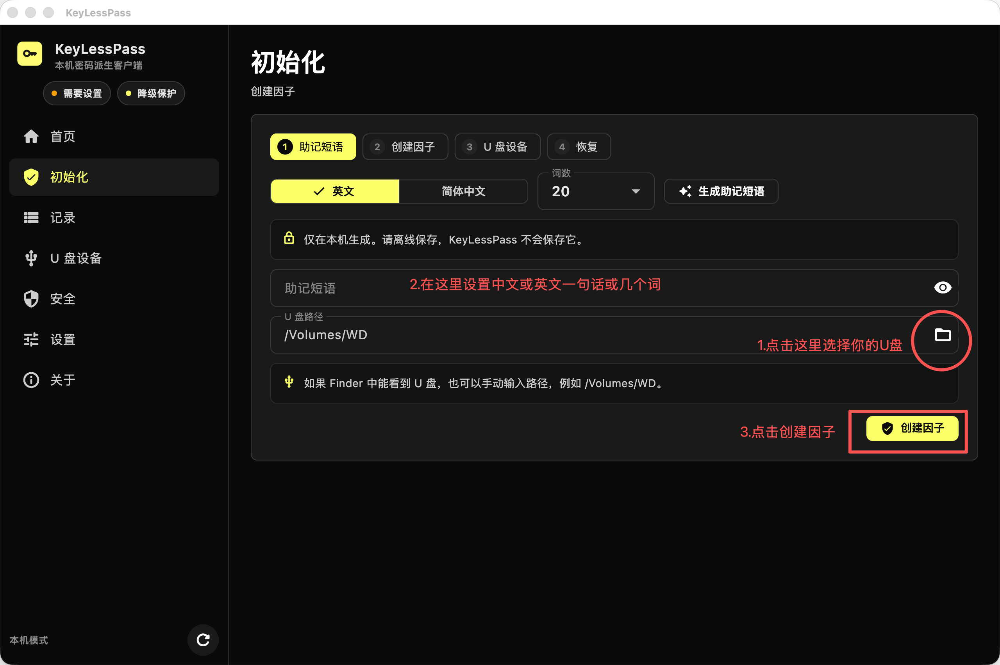
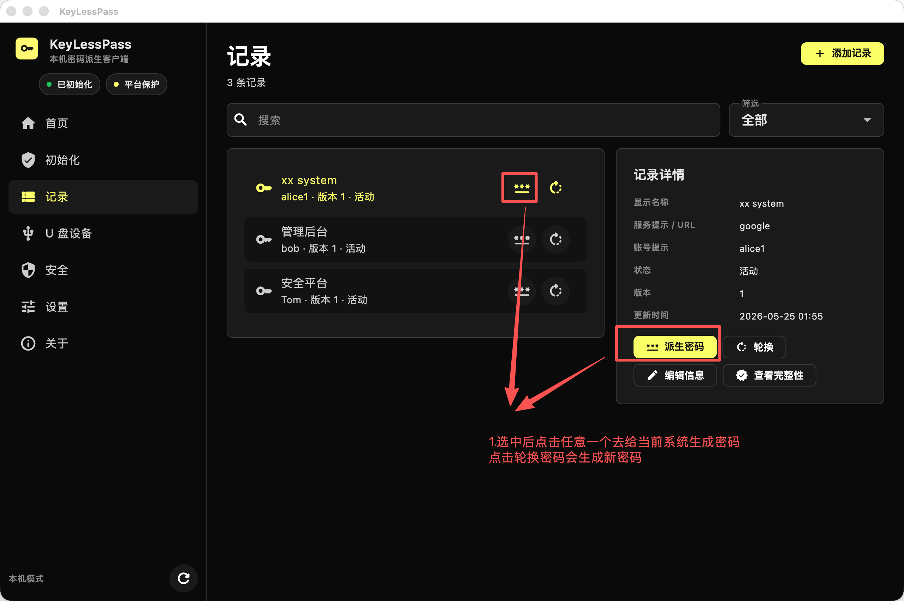
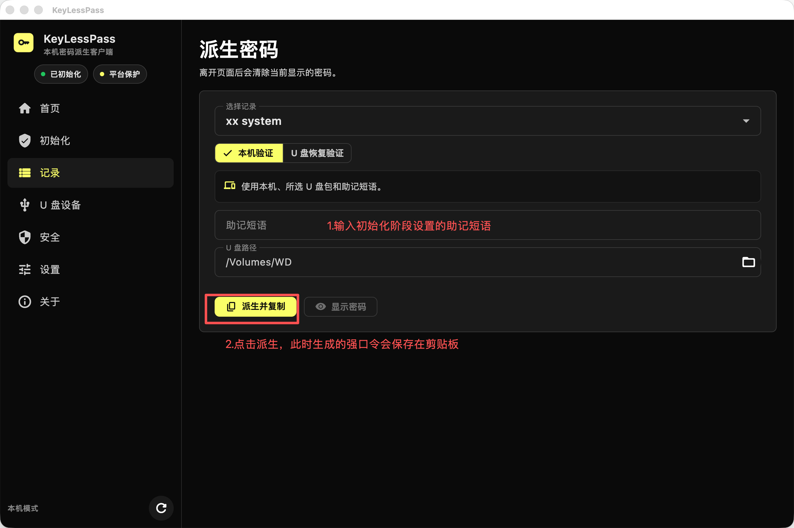
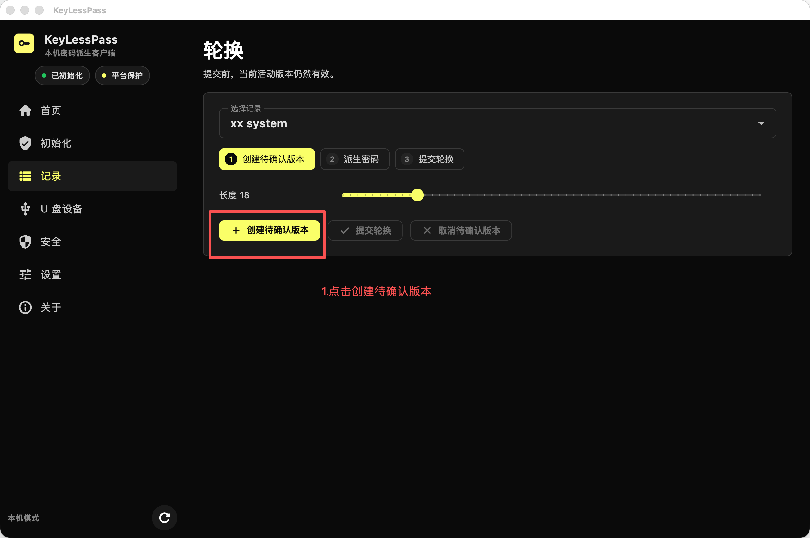
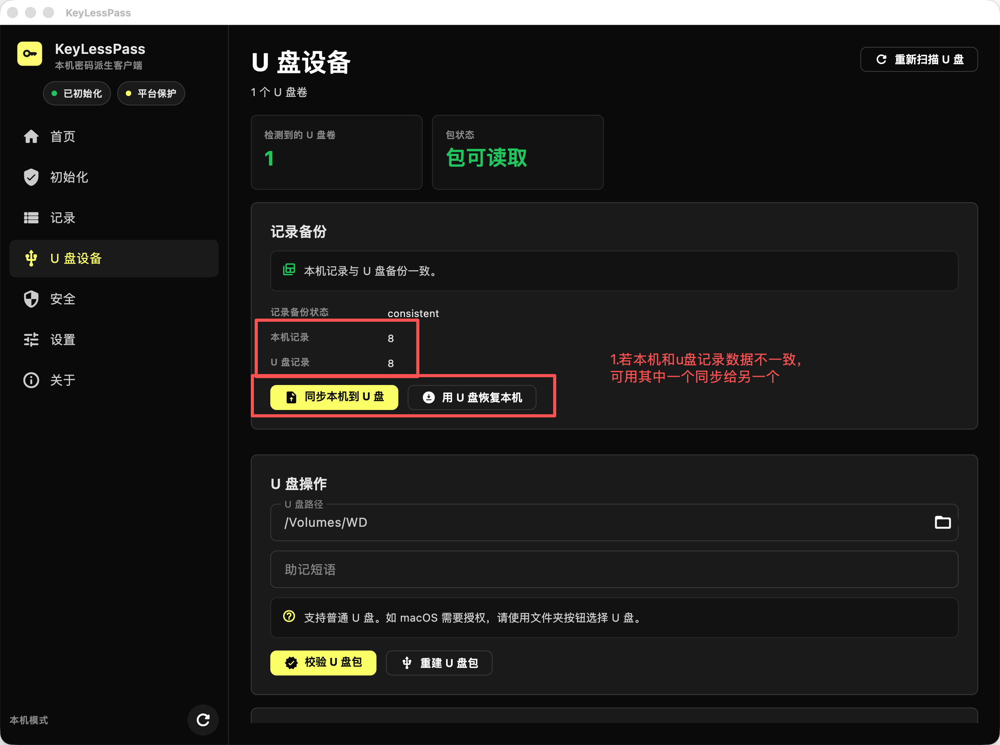
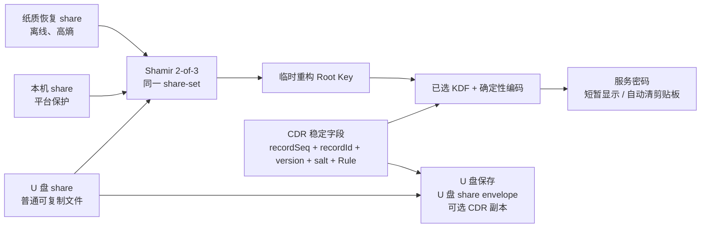

# KeyLessPass

> **v3 实现边界：** Rust Core 已提供经过认证和代际绑定的 Shamir 2-of-3 Root Key 恢复、CDR v3、策略编码、证据有界轮换及新鲜度接口。当前 Flutter 初始化界面仍生成 legacy v2 数据；v3 需通过 Rust 迁移接口启用，完整桌面迁移 UX 尚未交付。

<p align="center">
  
</p>

<p align="center">
  <strong>面向企业桌面场景的 storage-free 本机密码派生客户端。</strong>
</p>

<p align="center">
  <a href="README.md">English</a>
  ·
  <a href="SECURITY.md">Security</a>
  ·
  <a href="PRIVACY.md">Privacy</a>
  ·
  <a href="RELEASE.md">Release</a>
  ·
  <a href="DOCS.zh-CN.md">文档</a>
</p>

<p align="center">
  
  
  
  
  
</p>

<p align="center">
  <a href="https://github.com/ferrarif1/KeyLessPass/releases/tag/v0.1-jisa-2026-submission">
    
  </a>
  <a href="https://github.com/ferrarif1/KeyLessPass/releases/tag/v0.1-jisa-2026-submission">
    
  </a>
</p>

<p align="center">
  <sub>打开发布页面，根据自己的设备选择 macOS 或 Windows 客户端下载。</sub>
</p>

KeyLessPass 是一个真正的本机桌面客户端，用于企业内部仍依赖文本密码登录的遗留系统、运维控制台、厂商门户、数据库网关和网络设备。它按需派生服务密码，而不是保存服务密码库。

KeyLessPass 不是 Web 应用，不是浏览器插件，不是云密码管理器，也不是传统 vault。它不保存目标系统明文密码，不维护加密服务密码库，也不保存助记短语。

## 界面预览

| 初始化 | 记录 |
| --- | --- |
|  |  |

| 派生密码 | 轮换 |
| --- | --- |
|  |  |

| U 盘设备与恢复 |
| --- |
|  |

## 为什么选择 KeyLessPass

传统密码管理器保护的是一个已保存秘密的 vault。KeyLessPass 采用不同方式：只保存受保护的本机状态、U 盘因子材料、Credential Description Records 和恢复元数据。服务密码只在用户提供所需本地因子时临时派生。

这适合仍必须使用遗留密码系统的组织，同时避免在终端上沉淀一个可恢复的服务密码库。

## 核心能力

- Flutter Desktop 原生桌面 UI + Rust 安全核心。
- SQLite 仅保存非秘密 CDR 元数据和完整性标签。
- 普通 U 盘作为 USB 因子包载体。
- U 盘可备份 CDR 元数据，并支持本机与 U 盘记录一致性检查、显式同步或恢复。
- 初始化时随机生成每用户主密钥。
- 使用成熟的 `vsss-rs` 实现随机 Root Key 的 Shamir 2-of-3 分片，并以认证 envelope 绑定 vault、Root-Key generation、share-set 和 factor generation。
- 三个因素分别为离线纸质恢复 share、平台保护的本机 share 和普通可复制的 U 盘 share；纸质表示用于保存而非记忆，应用不会持久化它。
- 支持 share-set refresh，以及纸质恢复、本机和 U 盘因素替换，并拒绝过期 generation 的 share。
- 支持将 legacy v2 成对完整密钥包装验证迁移为 v3 shares，迁移不改变 Root Key 或既有派生密码。
- 派生路径基于稳定的 `recordSeq`、`recordId`、`version`、`salt` 和 `encodingDescriptor`。
- 新 profile 可选择服务派生算法：HKDF-SHA256、Argon2id、scrypt 或 PBKDF2-HMAC-SHA256。
- `displayName`、`serviceHint`、`accountHint`、备注仅用于展示和检索，修改后不改变密码。
- 证据有界密码轮换：用经认证的旧/新凭据探测收缩可能远端状态，并显式区分原子替换、先并存后撤销和不透明目标三类契约。
- 支持使用两个可用因子重建缺失的 U 盘包或本机包。
- 支持 U 盘路径选择、包校验和 U 盘包重建。
- 支持不含敏感数据的诊断信息导出。
- 预留 macOS、Windows、Linux 平台因子适配层。
- 支持英文和简体中文界面。

## 因素不坍缩网络恢复研究原型

可选的 Rust `peer-recovery` feature 提供一条独立研究路径：用加密网络
share 替换纸质 share，同时保持 Root Key 的 2-of-3 物理因素边界。原型
把经过认证的网络 share envelope 再做 3-of-5 Shamir 分片，并要求两名
独立审批者签名后，才通过临时 X25519/AES-GCM 会话释放片段。主动实现
不使用 Data Key、View Key、OPRF 或隐匿对象扫描。它尚未接入桌面产品
路径，也不声称生产级恢复传输或 Byzantine 节点容错。设计与证据见
[因素保持的异构 Root-Key 网络恢复方案](docs/research/FACTOR_PRESERVING_PEER_RECOVERY.zh-CN.md)。

## ASTER 研究制品

可选的 `research` feature 还包含 ASTER 的授权作用域精确域求值器和
failure-safe Root-Epoch 迁移模型；普通桌面产品路径不会启用该后端。仓库
提交实现、实验 harness、原始结果、TLA+ 模型和复现脚本；论文正文、渲染
图件和投稿包通过 `.gitignore` 排除，不属于软件/实验制品边界。

```bash
cd rust_core
cargo test --all-targets --all-features
cd ..
./research/aster/scripts/reproduce_all.sh --quick
```

证据层次、完整复现命令、测量边界和高成本 MPC 步骤见
[`research/aster/README.md`](research/aster/README.md)。

## 保存什么，不保存什么

| 保存 | 不保存 |
| --- | --- |
| 平台保护的本机 share envelope 和已提交 recovery manifest | 目标系统明文密码 |
| U 盘 share envelope、已提交 recovery manifest 和可选 CDR 副本 | 加密服务密码库 |
| 规范化 CDR 元数据、盐值、状态、副本元数据和 MAC 标签 | 任一 v3 持久化对象中的完整 Root Key |
| legacy v2 成对包装（仅保留到显式验证迁移完成） | 纸质恢复 share 表示（应用只显示，不持久化） |

## 简要工作原理

在 v3 恢复 schema 中，初始化或迁移以随机 256-bit Root Key 开始，并使用外部 `vsss-rs` 有限域实现产生 threshold 2、总数 3 的 shares：

```text
K_root <- Random(256 bits)
(S_recovery, S_computer, S_usb) <- ShamirSplit(2, 3, K_root)
K_purpose <- HKDF(K_root, vaultID || rootGeneration || suite || purposeLabel)
```

每个 share envelope 都绑定 vault、Root-Key generation、share-set ID、factor 类型/标识/generation、threshold、suite、编码版本和创建时间。重构后由 Root-Key 派生的 HMAC 验证这些元数据，KCV 用于拒绝错误的候选 Root Key。Shamir 本身不提供 share 认证、因素撤销或回滚防护；这些性质来自 envelope、已提交 manifest、generation 变化和可选 freshness anchor。

legacy v2 profile 只保留只读兼容和验证迁移路径。一旦 v3 manifest 提交，v3 恢复优先。当前 Flutter 初始化界面仍生成 v2 数据，因此选择 v3 需要 Rust 迁移 API。

为兼容旧数据，缺少算法字段的既有 profile 会按 legacy HKDF-SHA256 处理。新的 profile 可在初始化前选择 HKDF-SHA256、Argon2id、scrypt 或 PBKDF2-HMAC-SHA256；初始化完成后该选择会随本机配置和因子包锁定，如需更改，需要重置本机应用数据并重新初始化。

每条记录只保存非秘密 CDR 元数据。显示名称、服务提示、账号提示和备注可搜索、可编辑，但不参与派生路径。修改密码规则必须创建新版本，并被视为一次密码轮换。

当配对 U 盘可用时，KeyLessPass 可以把签名后的 CDR 元数据备份写入 U 盘。刷新或检测到 U 盘插入时，应用会比较本机 CDR 元数据和 U 盘备份，并提示用户选择将本机记录同步到 U 盘，或从 U 盘备份恢复本机记录。



## 安全模型

- 不把目标系统明文密码写入磁盘。
- 不维护加密服务密码库。
- 应用不持久化 v3 纸质恢复 share 表示。
- 不把完整 Root Key 作为任何 v3 本机或 U 盘 payload 字段持久化。
- U 盘包是普通可复制的因子容器，不是不可复制硬件密钥。
- 已提交 vault/share-set/generation 中任意两个有效 shares 可以恢复 Root Key；单个 share 会被恢复 API 拒绝。
- 不包含云同步、远程后台、浏览器自动填充或账号登录体系。
- 随机数来自操作系统 CSPRNG。
- 使用前校验 CDR 和因子包完整性。
- U 盘 CDR 备份受 MAC 保护，只包含元数据，不包含服务密码。
- 派生密码默认遮罩显示，并在配置时间后清空剪贴板。
- 日志不得包含纸质 share 表示、Root Key、因素秘密、HKDF 原始输出、AEAD key、HMAC key 或派生密码。

第一版客户端只承诺本地和 U 盘元数据的一致性/完整性检查。若需要更强回滚检测，可接入外部版本摘要、append-only 审计日志或可信单调状态。

## 桌面导航

当前主导航按稳定对象组织：

- 首页
- 初始化
- 记录
- U 盘设备
- 安全
- 设置
- 关于

添加记录、派生密码和轮换从“记录”进入；恢复工具放在“U 盘设备”中。

## 项目结构

```text
KeyLessPass
├── flutter_app/          # Flutter Desktop UI
├── rust_core/            # Rust 密码学、存储、恢复和 FFI 核心
├── packaging/            # macOS、Windows、Linux 打包脚本
├── experiments/          # 可复现实验输入和已记录结果
├── artifact/             # 机器可读 EPSCD 结果制品
├── formal/, models/, tla/ # TLA+ 规范和检查配置
├── research/aster/       # ASTER 实现、适配器、结果和脚本
├── docs/                 # 产品、安全、复现和设计文档
└── releases/             # 本地发布产物，git 忽略
```

论文源文件、渲染输出和期刊投稿包不属于版本化的软件/实验边界，均由 git 忽略。

Rust Core 刻意与平台安全存储细节解耦。平台因子 provider 通过统一接口实现，macOS Keychain、Windows DPAPI、Linux 本地/回退存储，以及后续 TPM/Secure Enclave 能力都隔离在 provider 层。

## 快速开始

### 环境要求

- Flutter Desktop SDK
- Rust toolchain
- macOS: Xcode，详见 [docs/MACOS_INSTALL.md](docs/MACOS_INSTALL.md)。
- Windows: Visual Studio Build Tools，详见 [docs/WINDOWS_INSTALL.md](docs/WINDOWS_INSTALL.md)。
- Linux: Flutter Linux desktop dependencies，详见 [docs/LINUX_INSTALL.md](docs/LINUX_INSTALL.md)。

每个平台说明都从安装 Flutter 开始，覆盖 Rust、运行、release 构建和打包注意事项。

### 测试 Rust Core

```bash
cd rust_core
cargo fmt --all -- --check
cargo clippy --all-targets --all-features -- -D warnings
cargo test --all-targets --all-features
```

### 运行桌面客户端

```bash
cd flutter_app
flutter pub get
flutter analyze
flutter test
flutter run -d macos
```

### macOS 发布构建

```bash
DEVELOPER_DIR=/Applications/Xcode.app/Contents/Developer \
FLUTTER_BIN=/path/to/flutter \
CODESIGN_IDENTITY='-' \
packaging/macos/build_dmg.sh
```

分发前需要使用 Developer ID Application 证书签名并 notarize。详见 [RELEASE.md](RELEASE.md)。

## 国际化

界面文案来自 Flutter ARB 资源：

- `flutter_app/lib/l10n/app_en.arb`
- `flutter_app/lib/l10n/app_zh.arb`

应用默认跟随系统语言，也可以在设置中手动切换 English / 简体中文。

## 当前状态

macOS 是当前主要验证平台。Windows 和 Linux 的架构、平台因子接口和打包入口已经预留，后续需要在真实系统上完成硬化和发布验证。

Rust 测试覆盖派生稳定性、元数据不可变边界、路径字段敏感性、篡改失败、缺失因子、轮换行为、恢复行为、U 盘 CDR 备份同步/恢复、助记短语重置和平台 provider trait。Flutter 测试覆盖 UI 构建、导航、语言切换和 i18n 资源完整性。

## 路线图

- Developer ID 签名和 notarized macOS DMG。
- Windows DPAPI 加固和 MSI 打包验证。
- Linux Secret Service/libsecret 可选支持，以及 deb/rpm/AppImage 打包验证。
- 可选外部版本摘要或 append-only 审计集成。
- 企业诊断导出和更严格的脱敏审查。

## 文档

完整中英文文档地图：[DOCS.zh-CN.md](DOCS.zh-CN.md) / [English](DOCS.md)。

| 你要做什么 | 看这里 |
| --- | --- |
| 本地运行桌面客户端 | [DEVELOPMENT.zh-CN.md](DEVELOPMENT.zh-CN.md) |
| 在 macOS / Windows / Linux 构建 | [macOS](docs/MACOS_INSTALL.md)、[Windows](docs/WINDOWS_INSTALL.md)、[Linux](docs/LINUX_INSTALL.md) |
| 准备发布 | [RELEASE.zh-CN.md](RELEASE.zh-CN.md) |
| 看安全和隐私说明 | [SECURITY.zh-CN.md](SECURITY.zh-CN.md)、[PRIVACY.zh-CN.md](PRIVACY.zh-CN.md) |
