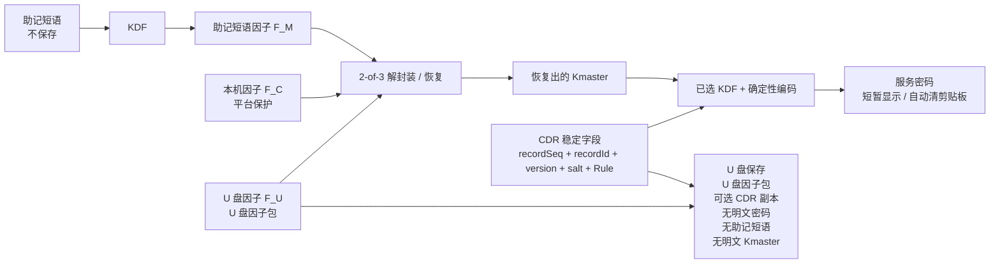

# KeyLessPass

> KeyLessPass is source-available, not open-source.
> The code is provided for evaluation, security review, learning, and non-commercial testing only.
> Commercial use, enterprise deployment, redistribution, OEM integration, white-label use, managed service use, or channel resale requires a separate written commercial license.

> KeyLessPass 采用“源码可见但非开源”的授权模式。
> 本仓库代码仅供评估、安全审查、学习和非商业测试使用。
> 企业部署、商业使用、二次分发、OEM 集成、白标使用、托管服务或渠道销售，均需另行取得书面商业授权。

<p align="center">
  
</p>

<p align="center">
  <strong>面向企业桌面场景的 storage-free 本机密码派生客户端。</strong>
</p>

<p align="center">
  <a href="README.md">English</a>
  ·
  <a href="SECURITY.md">Security</a>
  ·
  <a href="COMMERCIAL.md">Commercial</a>
  ·
  <a href="PRIVACY.md">Privacy</a>
  ·
  <a href="RELEASE.md">Release</a>
  ·
  <a href="DOCS.zh-CN.md">文档</a>
</p>

<p align="center">
  
  
  
  
  
</p>

<p align="center">
  <a href="https://github.com/ferrarif1/KeyLessPass/releases/tag/v0.1-jisa-2026-submission">
    
  </a>
  <a href="https://github.com/ferrarif1/KeyLessPass/releases/tag/v0.1-jisa-2026-submission">
    
  </a>
</p>

<p align="center">
  <sub>打开发布页面，根据自己的设备选择 macOS 或 Windows 客户端下载。</sub>
</p>

KeyLessPass 是一个真正的本机桌面客户端，用于企业内部仍依赖文本密码登录的遗留系统、运维控制台、厂商门户、数据库网关和网络设备。它按需派生服务密码，而不是保存服务密码库。

KeyLessPass 不是 Web 应用，不是浏览器插件，不是云密码管理器，也不是传统 vault。它不保存目标系统明文密码，不维护加密服务密码库，也不保存助记短语。

## 界面预览

| 初始化 | 记录 |
| --- | --- |
|  |  |

| 派生密码 | 轮换 |
| --- | --- |
|  |  |

| U 盘设备与恢复 |
| --- |
|  |

## 为什么选择 KeyLessPass

传统密码管理器保护的是一个已保存秘密的 vault。KeyLessPass 采用不同方式：只保存受保护的本机状态、U 盘因子材料、Credential Description Records 和恢复元数据。服务密码只在用户提供所需本地因子时临时派生。

这适合仍必须使用遗留密码系统的组织，同时避免在终端上沉淀一个可恢复的服务密码库。

## 核心能力

- Flutter Desktop 原生桌面 UI + Rust 安全核心。
- SQLite 仅保存非秘密 CDR 元数据和完整性标签。
- 普通 U 盘作为 USB 因子包载体。
- U 盘可备份 CDR 元数据，并支持本机与 U 盘记录一致性检查、显式同步或恢复。
- 初始化时随机生成每用户主密钥。
- 支持本机生成英文或简体中文助记短语，生成后不保存。
- 支持和论文一致的 2-of-3 本地恢复模型：`W_MC`、`W_MU`、`W_CU` 三组成对包装保护同一个 `Kmaster`。
- 支持使用本机设备和配对 U 盘重置助记短语，且不改变已有派生密码。
- 派生路径基于稳定的 `recordSeq`、`recordId`、`version`、`salt` 和 `encodingDescriptor`。
- 新 profile 可选择服务派生算法：HKDF-SHA256、Argon2id、scrypt 或 PBKDF2-HMAC-SHA256。
- `displayName`、`serviceHint`、`accountHint`、备注仅用于展示和检索，修改后不改变密码。
- 支持 pending / commit / cancel 的两阶段密码轮换。
- 支持使用两个可用因子重建缺失的 U 盘包或本机包。
- 支持 U 盘路径选择、包校验和 U 盘包重建。
- 支持不含敏感数据的诊断信息导出。
- 预留 macOS、Windows、Linux 平台因子适配层。
- 支持英文和简体中文界面。

## 保存什么，不保存什么

| 保存 | 不保存 |
| --- | --- |
| 本机因子包：`userId`、`deviceId`、`saltC`、助记短语 salt、助记短语校验器、`W_MC`、可选 `W_CU` 和 schema/version 元数据 | 目标系统明文密码 |
| U 盘因子包：`userId`、`usbId`、`saltU`、U 盘因子材料、`W_MU`、`W_CU` 和 schema/version 元数据 | 加密服务密码库 |
| CDR 元数据、盐值、版本、MAC 标签和可选 U 盘 CDR 备份 | 助记短语 |
| 平台保护的本机设备 secret，例如 macOS `com.keylesspass.local-factor` | 本机或 U 盘 payload 中的明文 `Kmaster` |
| 商业授权状态、签名 license bundle、商业设备 ID | 本机包中的 `usbSecret` 或 U 盘包中的 `deviceSecret` |

## 简要工作原理

初始化时，KeyLessPass 生成随机 256-bit 每用户主密钥。助记短语不是服务密码根种子，也不会被保存。它会先通过 KDF 形成独立的助记短语因子 `F_M`，再和本机因子 `F_C`、U 盘因子 `F_U` 一起参与本地 2-of-3 解封装/恢复模型，用于恢复 `Kmaster`。服务密码派生阶段使用恢复出的 `Kmaster` 和稳定的 CDR 路径字段。

```text
K_MC = HKDF(F_M || F_C, "KeyLessPass/wrap/MC")
K_MU = HKDF(F_M || F_U, "KeyLessPass/wrap/MU")
K_CU = HKDF(F_C || F_U, "KeyLessPass/wrap/CU")
```

任意两个因子都能恢复同一个 `Kmaster`：助记短语 + 本机使用 `W_MC`，助记短语 + U 盘使用 `W_MU`，本机 + U 盘使用 `W_CU`。任意单个因子不能恢复 `Kmaster`。日常派生默认使用助记短语 + 本机；U 盘平时可以离线保存，只在初始化、恢复本机、更换本机或重置助记短语时使用。

为兼容旧数据，缺少算法字段的既有 profile 会按 legacy HKDF-SHA256 处理。新的 profile 可在初始化前选择 HKDF-SHA256、Argon2id、scrypt 或 PBKDF2-HMAC-SHA256；初始化完成后该选择会随本机配置和因子包锁定，如需更改，需要重置本机应用数据并重新初始化。

每条记录只保存非秘密 CDR 元数据。显示名称、服务提示、账号提示和备注可搜索、可编辑，但不参与派生路径。修改密码规则必须创建新版本，并被视为一次密码轮换。

当配对 U 盘可用时，KeyLessPass 可以把签名后的 CDR 元数据备份写入 U 盘。刷新或检测到 U 盘插入时，应用会比较本机 CDR 元数据和 U 盘备份，并提示用户选择将本机记录同步到 U 盘，或从 U 盘备份恢复本机记录。



## 安全模型

- 不把目标系统明文密码写入磁盘。
- 不维护加密服务密码库。
- 不保存助记短语。
- 不把明文 `Kmaster` 作为本机或 U 盘 payload 字段持久化。
- 本机包不保存 `usbSecret`，U 盘包不保存 `deviceSecret`。
- U 盘包是普通可复制的因子容器，不是不可复制硬件密钥。
- 任意两个因子可以恢复 `Kmaster`，任意单个因子不能恢复。
- 不包含云同步、远程后台、浏览器自动填充或账号登录体系。
- 随机数来自操作系统 CSPRNG。
- 使用前校验 CDR 和因子包完整性。
- U 盘 CDR 备份受 MAC 保护，只包含元数据，不包含服务密码。
- 派生密码默认遮罩显示，并在配置时间后清空剪贴板。
- 日志不得包含助记短语、主密钥、因子秘密、HKDF 原始输出、AEAD key、HMAC key 或派生密码。

第一版客户端只承诺本地和 U 盘元数据的一致性/完整性检查。若需要更强回滚检测，可接入外部版本摘要、append-only 审计日志或可信单调状态。

## 桌面导航

当前主导航按稳定对象组织：

- 首页
- 初始化
- 记录
- U 盘设备
- 安全
- 设置
- 关于

添加记录、派生密码和轮换从“记录”进入；恢复工具放在“U 盘设备”中。

## 项目结构

```text
KeyLessPass
├── admin_backend/        # 内网商业设备授权后台
├── flutter_app/          # Flutter Desktop UI
├── rust_core/            # Rust 密码学、存储、恢复和 FFI 核心
├── packaging/            # macOS、Windows、Linux 打包脚本
├── docs/                 # 产品化、安全、发布和设计文档
└── releases/             # 本地发布产物，git 忽略
```

Rust Core 刻意与平台安全存储细节解耦。平台因子 provider 通过统一接口实现，macOS Keychain、Windows DPAPI、Linux 本地/回退存储，以及后续 TPM/Secure Enclave 能力都隔离在 provider 层。

商业设备授权是外层产品授权能力，不属于密码派生安全边界。`admin_backend`
可在企业内网部署，支持离线授权包和 HTTPS 在线激活，并提供角色权限、设备 CSV、
审计导出和跨批次席位控制。桌面客户端对所有授权结果进行本地签名校验，MDM 可向
平台托管路径下发授权包。该后台只保存商业授权元数据，不接收助记短语、`Kmaster`、因子 secret、CDR secret、服务密码或派生密码。商业客户端应在编译期启用授权强制检查，并且只嵌入厂商根公钥。客户现场公钥必须由厂商授权委托，设备密钥还必须出现在厂商签名白名单中。

## 快速开始

### 环境要求

- Flutter Desktop SDK
- Rust toolchain
- macOS: Xcode，详见 [docs/MACOS_INSTALL.md](docs/MACOS_INSTALL.md)。
- Windows: Visual Studio Build Tools，详见 [docs/WINDOWS_INSTALL.md](docs/WINDOWS_INSTALL.md)。
- Linux: Flutter Linux desktop dependencies，详见 [docs/LINUX_INSTALL.md](docs/LINUX_INSTALL.md)。

每个平台说明都从安装 Flutter 开始，覆盖 Rust、运行、release 构建和打包注意事项。

### 测试 Rust Core

```bash
cd rust_core
cargo test
```

### 运行桌面客户端

```bash
cd flutter_app
flutter pub get
flutter analyze
flutter test
flutter run -d macos
```

### 一键内网部署授权后台

```bash
cd admin_backend
./scripts/intranet_deploy.sh
```

脚本首次运行会生成管理员 token 和客户现场 Ed25519 密钥，然后等待厂商返回
`customer-entitlement.json` 和厂商根公钥。现场私钥只保存在内网后台；厂商根私钥永不交付客户。在线激活必须通过 HTTPS 暴露服务。`/download` 无需登录，管理操作需要 Admin token。

### 构建强制授权商业客户端

```bash
KEYLESSPASS_LICENSE_KEY_ID='keylesspass-vendor-root-2026' \
KEYLESSPASS_LICENSE_PUBLIC_KEY_B64='<厂商根公钥>' \
CODESIGN_IDENTITY='Developer ID Application: 你的公司 (TEAMID)' \
tools/commercial/build_commercial_release.sh macos
```

商业构建会设置 `KEYLESSPASS_REQUIRE_LICENSE=1`。正式分发仍应使用平台签名：
macOS Developer ID + notarization，Windows Authenticode，Linux 签名仓库或签名校验清单。

### macOS 发布构建

```bash
DEVELOPER_DIR=/Applications/Xcode.app/Contents/Developer \
FLUTTER_BIN=/path/to/flutter \
CODESIGN_IDENTITY='-' \
packaging/macos/build_dmg.sh
```

分发前需要使用 Developer ID Application 证书签名并 notarize。详见 [RELEASE.md](RELEASE.md)。

## 国际化

界面文案来自 Flutter ARB 资源：

- `flutter_app/lib/l10n/app_en.arb`
- `flutter_app/lib/l10n/app_zh.arb`

应用默认跟随系统语言，也可以在设置中手动切换 English / 简体中文。

## 当前状态

macOS 是当前主要验证平台。Windows 和 Linux 的架构、平台因子接口和打包入口已经预留，后续需要在真实系统上完成硬化和发布验证。

Rust 测试覆盖派生稳定性、元数据不可变边界、路径字段敏感性、篡改失败、缺失因子、轮换行为、恢复行为、U 盘 CDR 备份同步/恢复、助记短语重置和平台 provider trait。Flutter 测试覆盖 UI 构建、导航、语言切换和 i18n 资源完整性。

## 路线图

- Developer ID 签名和 notarized macOS DMG。
- Windows DPAPI 加固和 MSI 打包验证。
- Linux Secret Service/libsecret 可选支持，以及 deb/rpm/AppImage 打包验证。
- 可选外部版本摘要或 append-only 审计集成。
- 企业诊断导出和更严格的脱敏审查。

## 文档

完整中英文文档地图：[DOCS.zh-CN.md](DOCS.zh-CN.md) / [English](DOCS.md)。

| 你要做什么 | 看这里 |
| --- | --- |
| 本地运行桌面客户端 | [DEVELOPMENT.zh-CN.md](DEVELOPMENT.zh-CN.md) |
| 在 macOS / Windows / Linux 构建 | [macOS](docs/MACOS_INSTALL.md)、[Windows](docs/WINDOWS_INSTALL.md)、[Linux](docs/LINUX_INSTALL.md) |
| 部署授权后台 | [admin_backend/README.zh-CN.md](admin_backend/README.zh-CN.md) |
| 给设备授权 | [设备批量授权实现与使用指南](docs/commercial/device-batch-authorization-implementation.zh-CN.md) |
| 准备商业发布 | [RELEASE.zh-CN.md](RELEASE.zh-CN.md) 和 [商业发布加固](docs/commercial/commercial-release-hardening.zh-CN.md) |
| 看安全和隐私说明 | [SECURITY.zh-CN.md](SECURITY.zh-CN.md)、[PRIVACY.zh-CN.md](PRIVACY.zh-CN.md) |

## 授权许可

KeyLessPass 采用源码可见但非开源的授权模式。详见 [LICENSE](LICENSE)、[NOTICE](NOTICE) 和 [COMMERCIAL.md](COMMERCIAL.md)。

允许个人学习、评估、安全审查和非商业测试。企业生产部署、商业使用、二次分发、OEM 或白标集成、托管服务、安全服务打包、渠道销售，以及处理真实生产凭据，均需另行取得书面商业授权。

商业设备和席位管理采用“组织授权 + 单设备授权书”的签名授权模型。具体部署、构建、在线激活、离线批量签发、续期和吊销操作见[设备批量授权实现与使用指南](docs/commercial/device-batch-authorization-implementation.zh-CN.md)；设计方案见 [docs/commercial/device-batch-authorization.md](docs/commercial/device-batch-authorization.md)。
