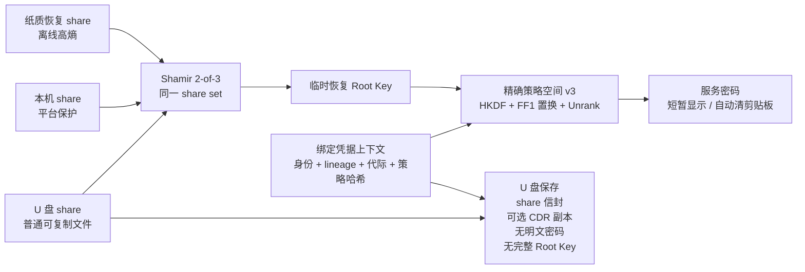

# KeyLessPass

> **当前实现：** 新初始化使用经过认证并与代际绑定的 Shamir 2-of-3 Root Key 恢复，新建凭据默认使用精确策略空间 v3 派生。旧的成对包装和旧派生算法只用于复现、验证和迁移既有数据，不再用于新记录。

<p align="center">
  
</p>

<p align="center">
  <strong>面向企业桌面场景的 storage-free 本机密码派生客户端。</strong>
</p>

<p align="center">
  <a href="README.md">English</a>
  ·
  <a href="SECURITY.md">Security</a>
  ·
  <a href="PRIVACY.md">Privacy</a>
  ·
  <a href="RELEASE.md">Release</a>
  ·
  <a href="DOCS.zh-CN.md">文档</a>
</p>

<p align="center">
  
  
  
  
  
</p>

<p align="center">
  <a href="https://github.com/ferrarif1/KeyLessPass/releases/tag/v0.1-jisa-2026-submission">
    
  </a>
  <a href="https://github.com/ferrarif1/KeyLessPass/releases/tag/v0.1-jisa-2026-submission">
    
  </a>
</p>

<p align="center">
  <sub>打开发布页面，根据自己的设备选择 macOS 或 Windows 客户端下载。</sub>
</p>

KeyLessPass 是一个真正的本机桌面客户端，用于企业内部仍依赖文本密码登录的遗留系统、运维控制台、厂商门户、数据库网关和网络设备。它按需派生服务密码，而不是保存服务密码库。

KeyLessPass 不是 Web 应用，不是浏览器插件，不是云密码管理器，也不是传统 vault。它不保存目标系统明文密码，不维护加密服务密码库，也不保存助记短语。

## 界面预览

| 初始化 | 记录 |
| --- | --- |
|  |  |

| 派生密码 | 轮换 |
| --- | --- |
|  |  |

| U 盘设备与恢复 |
| --- |
|  |

## 为什么选择 KeyLessPass

传统密码管理器保护的是一个已保存秘密的 vault。KeyLessPass 采用不同方式：只保存受保护的本机状态、U 盘因子材料、Credential Description Records 和恢复元数据。服务密码只在用户提供所需本地因子时临时派生。

这适合仍必须使用遗留密码系统的组织，同时避免在终端上沉淀一个可恢复的服务密码库。

## 核心能力

- Flutter Desktop 原生桌面 UI + Rust 安全核心。
- SQLite 仅保存非秘密 CDR 元数据和完整性标签。
- 普通 U 盘作为 USB 因子包载体。
- U 盘可备份 CDR 元数据，并支持本机与 U 盘记录一致性检查、显式同步或恢复。
- 初始化时随机生成每用户主密钥。
- 使用成熟的 Shamir 2-of-3 实现拆分随机 Root Key，并以认证信封绑定 vault、Root 代际、share set、因子身份和因子代际。
- 纸质恢复份额是带校验的高熵离线份额表示，不要求用户记忆，应用不持久化保存其明文。
- 新建凭据使用精确有限策略编译、准确空间计数、Rank/Unrank 和按 generation 索引的 FF1 cycle walking。
- v3 凭据上下文绑定 vault、服务、账号、lineage、凭据盐、Root 代际、策略身份、策略哈希、策略版本和 policy epoch。
- 在同一 lineage 和未耗尽的受支持策略域内，不同 generation 不会重复；不支持、过小、过大或耗尽的策略域会 fail closed。
- `displayName`、`serviceHint`、`accountHint`、备注仅用于展示和检索，修改后不改变密码。
- 支持证据约束的密码轮换；仅收到修改成功响应不会直接提交，必须记录新旧密码的远端认证证据。
- 新候选会排除可在本地重新派生的近期历史 generation，远端结果不确定时继续保留旧记录为活动版本。
- 支持使用两个可用因子重建缺失的 U 盘包或本机包。
- 支持 U 盘路径选择、包校验和 U 盘包重建。
- 支持不含敏感数据的诊断信息导出。
- 预留 macOS、Windows、Linux 平台因子适配层。
- 支持英文和简体中文界面。

## 保存什么，不保存什么

| 保存 | 不保存 |
| --- | --- |
| 平台保护的本机 share 信封和已提交恢复 manifest | 目标系统明文密码 |
| U 盘 share 信封、已提交 manifest 和可选 CDR 元数据副本 | 加密服务密码库 |
| 规范化 CDR、凭据盐、lineage、代际、策略描述、轮换状态、远端证据和 MAC 标签 | 持久化的完整 Root Key |
| 仅在迁移完成前保留的 legacy v2 元数据 | 纸质恢复份额明文 |

## 简要工作原理

初始化时，KeyLessPass 生成随机 256-bit Root Key，并通过标准 Shamir 2-of-3 拆分为纸质恢复、本机和 U 盘三个 share。每个 share 信封都绑定 vault、Root 代际、share-set ID、因子类型与身份、因子代际、阈值、套件和编码版本；重构后使用 Root-Key 派生的完整性标签和 key-confirmation value 验证候选密钥。Shamir 本身不承担认证、撤销或回滚保护，这些性质由信封、已提交 manifest、代际更新和可选 freshness anchor 提供。

```text
K_root <- Random(256 bits)
(S_recovery, S_computer, S_usb) <- ShamirSplit(2, 3, K_root)
K_purpose <- HKDF(K_root, vaultID || rootGeneration || suite || purposeLabel)
```

任意两个属于同一已提交 vault、share set 和 Root 代际的有效 share 可以恢复 Root Key；一个 share 不足以恢复。Root Key、临时 share、凭据专用密钥和派生密码使用后在能力范围内清理，但若终端在合法重构期间已被完全攻破，本方案不承诺保密性。

为兼容旧数据，既有记录按照自身保存的 legacy 派生版本复现。新记录不提供 KDF 选择器，而是固定使用精确策略空间 v3：HKDF-SHA256 做密钥隔离，FF1 cycle walking 把 credential generation 映射到准确计数的策略域，再由 `Unrank` 得到唯一合法密码。

每条记录只保存非秘密 CDR 元数据。显示名称、服务提示、账号提示和备注可搜索、可编辑，但不参与派生路径。修改密码规则必须创建新版本，并被视为一次密码轮换。

当配对 U 盘可用时，KeyLessPass 可以把签名后的 CDR 元数据备份写入 U 盘。刷新或检测到 U 盘插入时，应用会比较本机 CDR 元数据和 U 盘备份，并提示用户选择将本机记录同步到 U 盘，或从 U 盘备份恢复本机记录。



## 安全模型

- 不把目标系统明文密码写入磁盘。
- 不维护加密服务密码库。
- 不持久化保存纸质恢复 share 明文。
- 不把完整 Root Key 作为本机或 U 盘 payload 字段持久化。
- U 盘包是普通可复制的因子容器，不是不可复制硬件密钥。
- 任意两个同集合有效 share 可以恢复 Root Key，任意单个 share 不能恢复。
- 不包含云同步、远程后台、浏览器自动填充或账号登录体系。
- 随机数来自操作系统 CSPRNG。
- 使用前校验 CDR 和因子包完整性。
- U 盘 CDR 备份受 MAC 保护，只包含元数据，不包含服务密码。
- 派生密码默认遮罩显示，并在配置时间后清空剪贴板。
- 日志不得包含助记短语、主密钥、因子秘密、HKDF 原始输出、AEAD key、HMAC key 或派生密码。

纯客户端模式只能发现部分副本不一致；企业锚定模式提供最小 compare-and-set freshness 接口，但仓库不交付生产远端 freshness 服务。

论文对应的 ASTER research profile 还实现了签名精确作用域 capability、持久化使用次数、Root-Epoch replacement、descriptor-only migration、故障注入、TLA+ 模型以及独立的 MP-SPDZ 固定电路可行性实验。它与本地桌面兼容 profile 有意分离：进程内 semantic evaluator 不是门限后端，MP-SPDZ 电路也不是软件发布版的生产服务。详见 [ASTER 实现边界](docs/ASTER_IMPLEMENTATION_PROFILE.md)。

## 桌面导航

当前主导航按稳定对象组织：

- 首页
- 初始化
- 记录
- U 盘设备
- 安全
- 设置
- 关于

添加记录、派生密码和轮换从“记录”进入；恢复工具放在“U 盘设备”中。

## 项目结构

```text
KeyLessPass
├── flutter_app/          # Flutter Desktop UI
├── rust_core/            # Rust 密码学、存储、恢复和 FFI 核心
├── packaging/            # macOS、Windows、Linux 打包脚本
├── docs/                 # 产品化、安全、发布和设计文档
└── releases/             # 本地发布产物，git 忽略
```

Rust Core 刻意与平台安全存储细节解耦。平台因子 provider 通过统一接口实现，macOS Keychain、Windows DPAPI、Linux 本地/回退存储，以及后续 TPM/Secure Enclave 能力都隔离在 provider 层。

## 快速开始

### 环境要求

- Flutter Desktop SDK
- Rust toolchain
- macOS: Xcode，详见 [docs/MACOS_INSTALL.md](docs/MACOS_INSTALL.md)。
- Windows: Visual Studio Build Tools，详见 [docs/WINDOWS_INSTALL.md](docs/WINDOWS_INSTALL.md)。
- Linux: Flutter Linux desktop dependencies，详见 [docs/LINUX_INSTALL.md](docs/LINUX_INSTALL.md)。

每个平台说明都从安装 Flutter 开始，覆盖 Rust、运行、release 构建和打包注意事项。

### 测试 Rust Core

```bash
cd rust_core
cargo test
```

### 复现 ASTER 研究工件

```bash
./research/aster/scripts/reproduce_all.sh --quick
```

运行完整目标前请先阅读 [research/aster/README.md](research/aster/README.md) 与 [research/aster/LIMITATIONS.md](research/aster/LIMITATIONS.md)。

### 运行桌面客户端

```bash
cd flutter_app
flutter pub get
flutter analyze
flutter test
flutter run -d macos
```

### macOS 发布构建

```bash
DEVELOPER_DIR=/Applications/Xcode.app/Contents/Developer \
FLUTTER_BIN=/path/to/flutter \
CODESIGN_IDENTITY='-' \
packaging/macos/build_dmg.sh
```

分发前需要使用 Developer ID Application 证书签名并 notarize。详见 [RELEASE.md](RELEASE.md)。

## 国际化

界面文案来自 Flutter ARB 资源：

- `flutter_app/lib/l10n/app_en.arb`
- `flutter_app/lib/l10n/app_zh.arb`

应用默认跟随系统语言，也可以在设置中手动切换 English / 简体中文。

## 当前状态

macOS 是当前主要验证平台。Windows 和 Linux 的架构、平台因子接口和打包入口已经预留，后续需要在真实系统上完成硬化和发布验证。

Rust 测试覆盖派生稳定性、元数据不可变边界、路径字段敏感性、篡改失败、缺失因子、轮换行为、恢复行为、U 盘 CDR 备份同步/恢复、助记短语重置和平台 provider trait。Flutter 测试覆盖 UI 构建、导航、语言切换和 i18n 资源完整性。

## 路线图

- Developer ID 签名和 notarized macOS DMG。
- Windows DPAPI 加固和 MSI 打包验证。
- Linux Secret Service/libsecret 可选支持，以及 deb/rpm/AppImage 打包验证。
- 可选外部版本摘要或 append-only 审计集成。
- 企业诊断导出和更严格的脱敏审查。

## 文档

完整中英文文档地图：[DOCS.zh-CN.md](DOCS.zh-CN.md) / [English](DOCS.md)。

| 你要做什么 | 看这里 |
| --- | --- |
| 本地运行桌面客户端 | [DEVELOPMENT.zh-CN.md](DEVELOPMENT.zh-CN.md) |
| 在 macOS / Windows / Linux 构建 | [macOS](docs/MACOS_INSTALL.md)、[Windows](docs/WINDOWS_INSTALL.md)、[Linux](docs/LINUX_INSTALL.md) |
| 准备发布 | [RELEASE.zh-CN.md](RELEASE.zh-CN.md) |
| 看安全和隐私说明 | [SECURITY.zh-CN.md](SECURITY.zh-CN.md)、[PRIVACY.zh-CN.md](PRIVACY.zh-CN.md) |

## 授权许可

详见 [LICENSE](LICENSE) 和 [NOTICE](NOTICE)。
